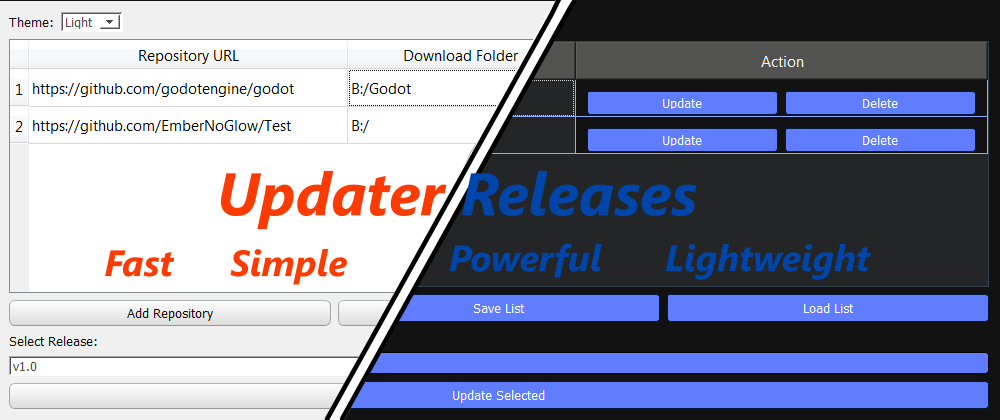
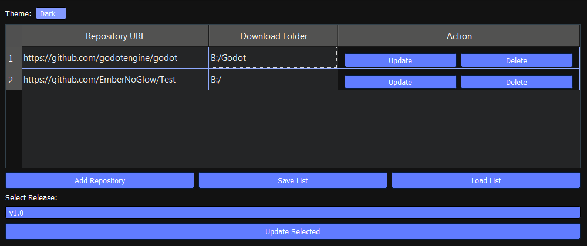
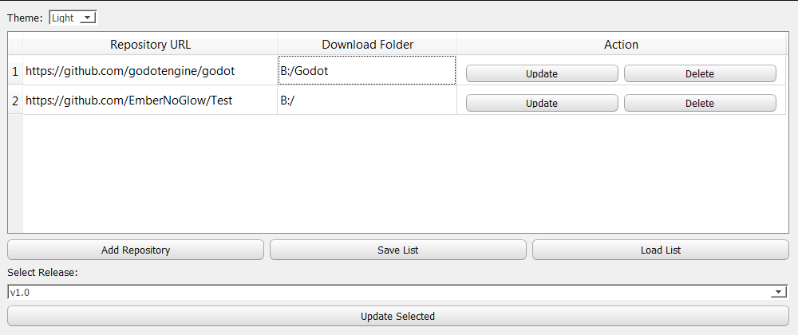

# Updater Releases - Your Github Repository Updater

A **fast**, **lightweight**, and **simple** utility written in **Python** to streamline the process of updating your applications from **GitHub releases**.




---

## What is it?
Updater Releases is a powerful and fast utility written in python to speed up the process of updating an application from Github

---


## Features
1.  **Speedy Updates:** Quickly download and deploy new releases from GitHub.
2.  **User-Friendly Interface:** Intuitive GUI for easy repository management and updates.
3.  **Lightweight & Efficient:** Minimal resource usage.
4.  **GitHub API Integration:** Seamlessly interacts with GitHub to fetch release information and assets.
5.  **Repository Management:** Save and load lists of your repositories for quick access.
6. **Dark** and Light **themes** support:

    
    


---


## Usage
1. Download the **updater_releases.exe file** or **source code** from [Releases](https://github.com/EmberNoGlow/Updater-Releases/releases) and run **updater_releases.exe** or **main.py**.
2. Add a link to your **Github repositories** by clicking on add repository and **entering the url**.
    


3. After adding the repository, make sure to click on **"update"** in the actions column **to update the repository information**, which will allow you to select the desired release from the list below.
4. **Select the repository/repositories** (if you have added multiple) by clicking on them and then click on **"Update Selected"**
    
5. Select the desired asset and **wait** for the download to complete
    
6. You're done! You've **updated your repositories** in `three to five` clicks!
    


P.S. You **can save** the list of your repositories in **repositories.json** by clicking on save repositories, which will allow the app to automatically load the list of your repositories **when it starts**.


---

## Dependencies

To run the project from **source code**, you need to install the following packages:

```
pip install requests PySide2
```
---

## Compilation & Building

### **Pre-compiled Executable (Windows):**

A ready-to-use **`updater_releases.exe`** is available in the [Releases](https://github.com/EmberNoGlow/Updater-Releases/releases) section for Windows users.

### **Building from Source Code (Windows):**

To compile the project into an executable on Windows yourself:
1.  Install `pyinstaller`:
    ```bash
    pip install pyinstaller
    ```
2.  Run the compilation command in your project directory:
    ```bash
    pyinstaller -F -n "updater_releases.exe" --icon=app_icon.ico main.py
    ```

### **Cross-Platform Builds:**

At the moment, I am unable to provide pre-compiled binaries for platforms other than Windows (e.g., Linux, macOS). If you have the capability and knowledge to compile the project on your system, your contribution would be invaluable. Please consider submitting your build files or a pull request. Your assistance in making the application accessible on more platforms is greatly appreciated!

---

**Enjoying Updater Releases?**

If you found this project helpful or like what you see, please consider:

⭐ **Starring the repository** ⭐


🔗 **[Visiting my GitHub profile](https://github.com/EmberNoGlow)** for other projects and contributions.

Your support is greatly appreciated!
